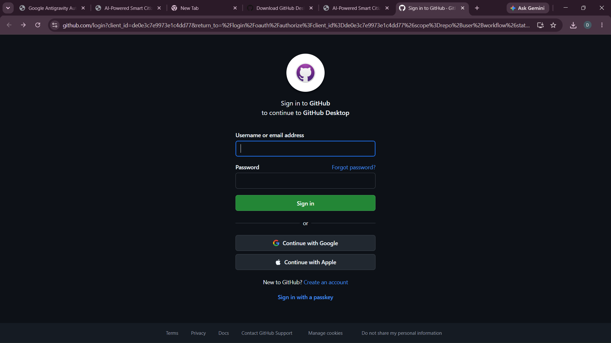

# CodeSage AI

An AI-powered code review and execution platform. Paste or browse code, pick an AI provider, and get a structured review with scores, severity-tagged issues, and actionable suggestions — all running in your browser.



---

## Features

- **AI Code Review** — deep analysis with scores, severity badges, and fix suggestions
- **Multi-provider AI** — supports Groq, OpenAI, Gemini, Anthropic (Claude), xAI (Grok), NVIDIA NIM, and OpenRouter with automatic fallback
- **In-browser Execution** — run code directly in the browser via WebContainers, CheerpX, or v86
- **GitHub Integration** — OAuth login, repo browsing, file tree, and commit workflow
- **Project Workspace** — Monaco editor, file tree, execution panel, and agent-driven project generation
- **3-Agent Project Scaffolding** — Agent 1 (dependencies/config) → Agent 2 (source code) → Agent 3 (verifier/fixer)
- **Agent Task Queue** — async AI task management with per-user task tracking
- **Customizable Theme** — per-user color settings persisted locally
- **Deployable to Render** — includes `render.yaml` for one-click cloud deployment

---

## Tech Stack

| Layer | Technology |
|---|---|
| Frontend | React 19, TypeScript, Vite, Tailwind CSS v4 |
| UI Components | shadcn/ui (Radix UI), Lucide icons, Framer Motion |
| Editor | Monaco Editor |
| In-browser Runtime | WebContainers, CheerpX, v86 |
| Backend | Node.js, Express |
| Auth & Database | Supabase (PostgreSQL + Auth) |
| Auth Flow | GitHub OAuth + JWT cookies |
| AI Providers | Groq, OpenAI, Gemini, Anthropic, xAI, NVIDIA NIM, OpenRouter |

---

## Getting Started

### Prerequisites

- Node.js 18+
- A [Supabase](https://supabase.com) project
- A [GitHub OAuth App](https://github.com/settings/developers)
- At least one AI provider API key (Groq has a free tier)

### 1. Clone the repo

```bash
git clone https://github.com/your-username/codesage-ai.git
cd codesage-ai
```

### 2. Configure environment variables

**Frontend** — copy and fill in `e:/project/.env`:

```bash
cp .env.example .env
```

```env
VITE_API_URL=http://localhost:3001
VITE_SUPABASE_URL=https://your-project-ref.supabase.co
VITE_SUPABASE_ANON_KEY=your_supabase_anon_key_here
```

**Backend** — copy and fill in `server/.env`:

```bash
cp server/.env.example server/.env
```

```env
SUPABASE_URL=https://your-project-ref.supabase.co
SUPABASE_SERVICE_ROLE_KEY=your_service_role_key_here

JWT_SECRET=your_64_char_random_hex_string

GITHUB_CLIENT_ID=your_github_oauth_client_id
GITHUB_CLIENT_SECRET=your_github_oauth_client_secret

# Add at least one AI provider key
GROQ_API_KEY=your_groq_api_key_here
```

> Generate a JWT secret: `node -e "console.log(require('crypto').randomBytes(64).toString('hex'))"`

### 3. Set up the database

Run the migration in your Supabase SQL editor:

```bash
# Contents of supabase/migrations/20260704173746_create_github_profiles.sql
```

Or run `supabase-setup.sql` directly in the Supabase dashboard.

### 4. Start the development servers

**Windows:**

```bat
start.bat
```

This opens two terminal windows — backend on `:3001` and frontend on `:5173`.  
To stop both: run `kill.bat`.

**Manual:**

```bash
# Terminal 1 — backend
cd server
npm install
npm run dev

# Terminal 2 — frontend
npm install
npm run dev
```

Open [http://localhost:5173](http://localhost:5173).

---

## AI Providers

You can configure keys server-side (`.env`) or per-user via the Settings dialog in the app. Server keys act as a shared fallback; user keys take priority.

| Provider | Env Variable | Get a Key |
|---|---|---|
| Groq | `GROQ_API_KEY` | [console.groq.com/keys](https://console.groq.com/keys) |
| OpenAI | `OPENAI_API_KEY` | [platform.openai.com/api-keys](https://platform.openai.com/api-keys) |
| Google Gemini | `GEMINI_API_KEY` | [aistudio.google.com](https://aistudio.google.com/app/apikey) |
| Anthropic | `ANTHROPIC_API_KEY` | [console.anthropic.com](https://console.anthropic.com/settings/keys) |
| xAI Grok | `XAI_API_KEY` | [console.x.ai](https://console.x.ai) |
| NVIDIA NIM | `NVIDIA_API_KEY` | [build.nvidia.com](https://build.nvidia.com) |
| OpenRouter | `OPENROUTER_API_KEY` | [openrouter.ai/keys](https://openrouter.ai/keys) |

If the primary provider fails or hits a rate limit, the server automatically falls back through the available providers.

---

## GitHub OAuth Setup

1. Go to [github.com/settings/developers](https://github.com/settings/developers) → **OAuth Apps** → **New OAuth App**
2. Set:
   - **Homepage URL:** `http://localhost:5173`
   - **Authorization callback URL:** `http://localhost:3001/auth/github/callback`
3. Copy the **Client ID** and **Client Secret** into `server/.env`

For production, update both URLs to your deployed domain.

---

## Deployment (Render)

The repo includes `render.yaml` for one-click deployment to [Render](https://render.com).

1. Push to GitHub
2. Create a new **Blueprint** on Render and point it at your repo
3. In the Render dashboard, fill in the secret environment variables (Supabase keys, JWT secret, GitHub OAuth, AI keys)
4. Update `SERVER_URL` and `CLIENT_URL` to your Render service URL

Build command: `npm install && npm run build && cd server && npm install`  
Start command: `cd server && node index.js`

---

## Project Structure

```
codesage-ai/
├── src/                    # React frontend
│   ├── components/         # UI components (ReviewPanel, FileTree, etc.)
│   ├── pages/              # LandingPage, DashboardPage
│   ├── services/           # API calls, GitHub, settings, storage
│   ├── hooks/              # Custom React hooks
│   └── types/              # TypeScript types
├── server/                 # Express backend
│   ├── controllers/        # Route handlers
│   ├── routes/             # API route definitions
│   ├── services/           # AI, GitHub, Supabase services
│   ├── prompts/            # AI prompt templates
│   └── utils/              # Sandbox utilities
├── supabase/
│   └── migrations/         # Database schema
├── .env.example            # Frontend env template
├── server/.env.example     # Backend env template
├── render.yaml             # Render deployment config
├── start.bat               # Windows dev launcher
└── kill.bat                # Windows dev stopper
```

---

## API Endpoints

| Method | Path | Description |
|---|---|---|
| `GET` | `/health` | Server health + configured providers |
| `POST` | `/api/review` | Submit code for AI review |
| `GET` | `/api/providers` | Which AI providers are server-configured |
| `GET` | `/auth/github` | Start GitHub OAuth flow |
| `GET` | `/auth/github/callback` | OAuth callback |
| `POST` | `/api/agent/workload` | Enqueue an async AI task |
| `GET` | `/api/agent/tasks` | List user's tasks |
| `GET` | `/api/agent/tasks/:id` | Get task status |
| `GET/POST` | `/api/git/*` | GitHub repo operations |
| `GET/POST` | `/api/project/*` | Project management |

---

## License

[MIT](./LICENSE)
